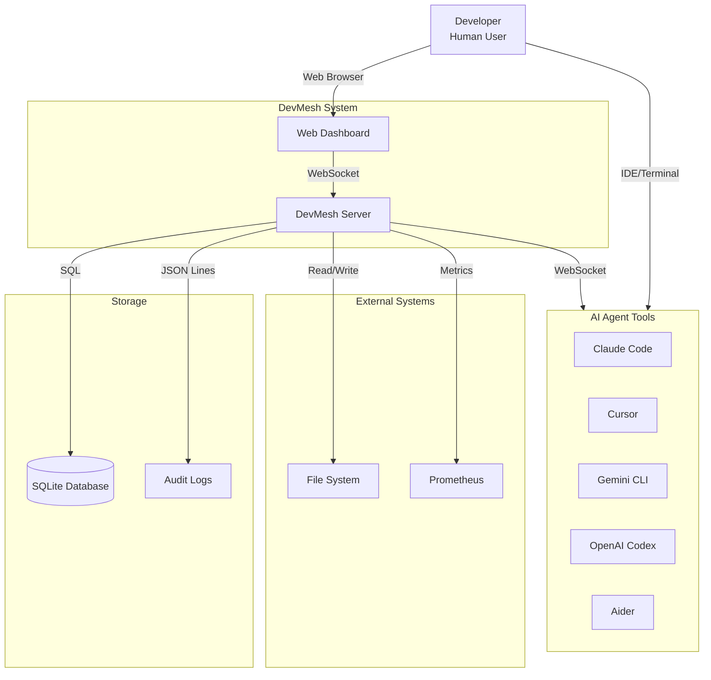
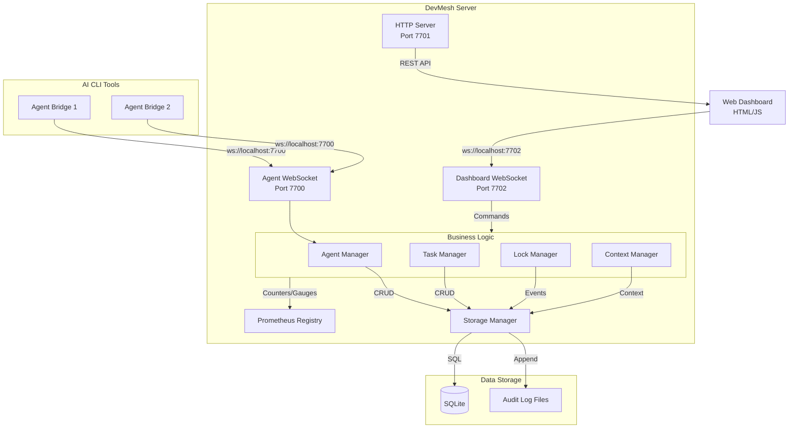
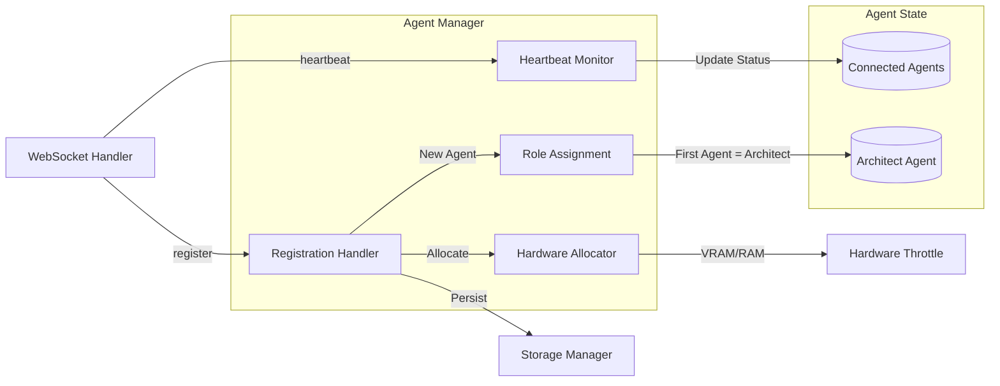
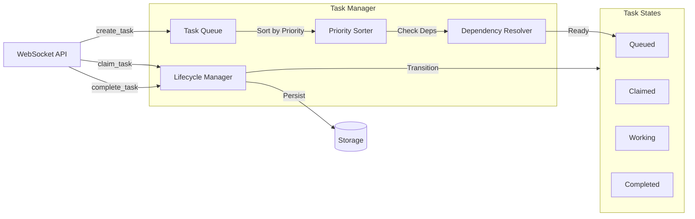
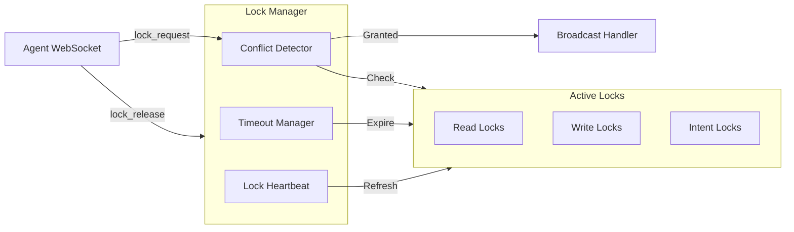
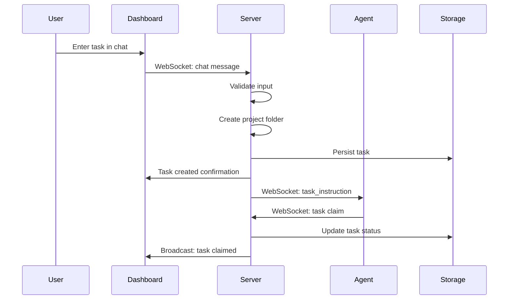
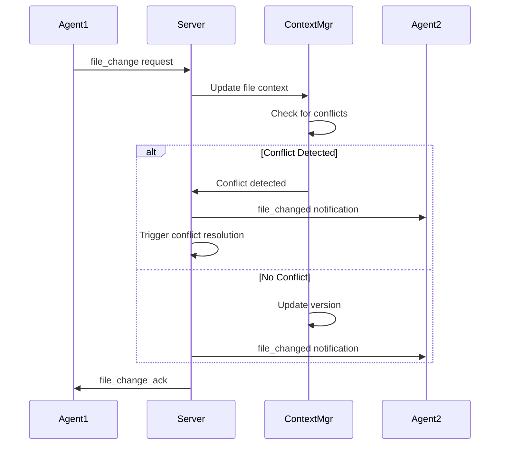
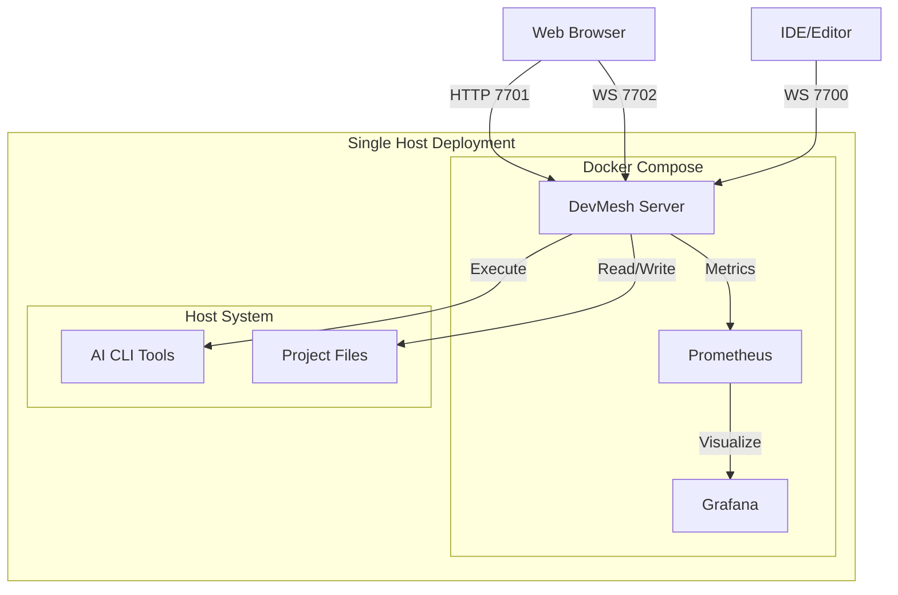

# DevMesh Architecture Documentation

## Overview

DevMesh is a local multi-agent orchestration framework that coordinates multiple AI CLI tools to work together on software development tasks.

## System Context (C4 Level 1)

## Container Diagram (C4 Level 2)

## Component Diagram (C4 Level 3)

### Agent Manager

### Task Manager

### Lock Manager

## Data Flow

### Task Creation Flow

### File Change Coordination

## Deployment Architecture

## Technology Stack

| Layer | Technology |
|-------|------------|
| Language | Python 3.12+ |
| Async Framework | asyncio, websockets |
| Database | SQLite with WAL mode |
| Serialization | orjson (fast JSON) |
| Metrics | Prometheus client |
| Web Server | http.server (built-in) |
| Dashboard | Vanilla HTML/JS |

## Scalability Considerations

1. **Single Node**: DevMesh is designed to run on a single developer workstation
2. **No Horizontal Scaling**: Not designed for multi-node deployment
3. **Resource Limits**: Hardware throttle prevents resource exhaustion
4. **Connection Limits**: Rate limiting prevents connection flooding

## Security Architecture

1. **Local Only**: By default, binds to 127.0.0.1 only
2. **No Authentication**: Assumes trusted local environment
3. **Input Validation**: All inputs sanitized before processing
4. **Path Traversal Protection**: File operations validated
5. **CORS**: Configured for local development
