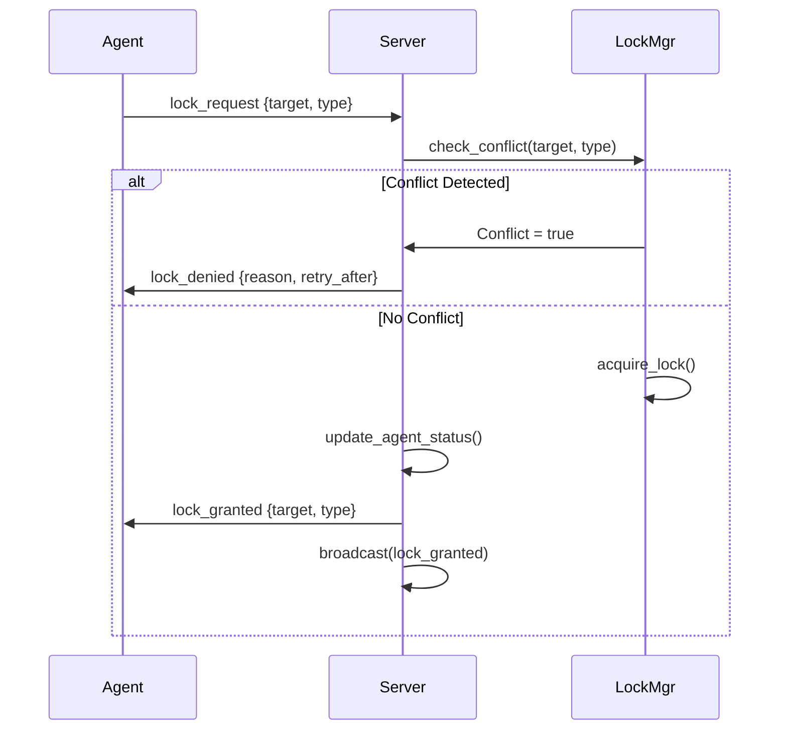
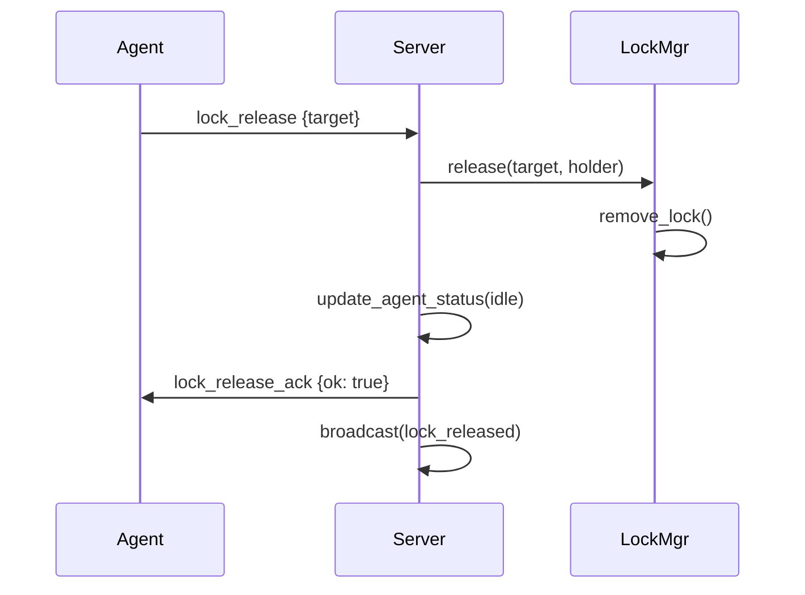
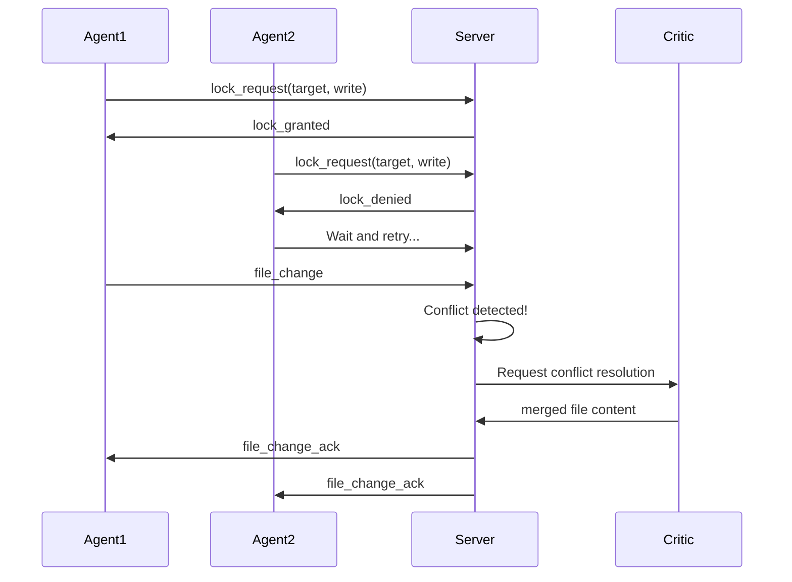
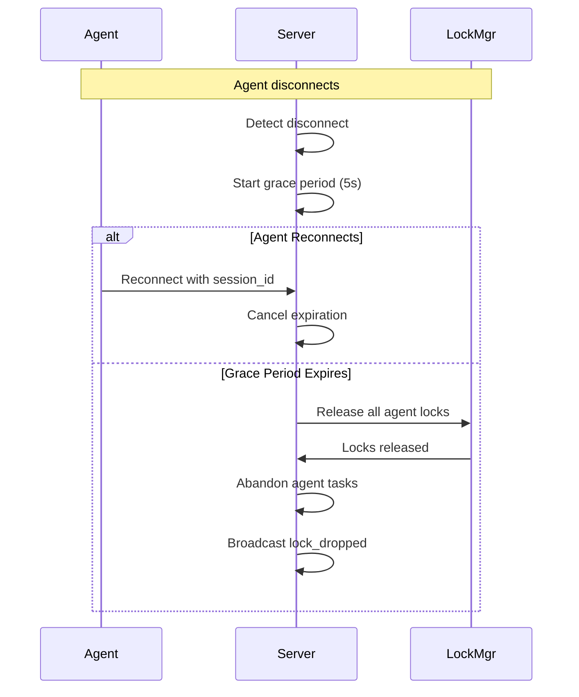

# DevMesh Lock Protocol

## Overview

The DevMesh Lock Protocol coordinates file access between multiple AI agents to prevent conflicts and ensure consistency. It implements a distributed locking mechanism with support for read, write, intent, and co-write lock types.

## Lock Types

| Type | Symbol | Description |
|------|--------|-------------|
| **READ** | `R` | Allows concurrent reads, blocks writes |
| **WRITE** | `W` | Exclusive access, blocks all other locks |
| **INTENT** | `I` | Signals intent to write, used for planning |
| **CO_WRITE** | `C` | Collaborative write, allows multiple writers |

## Conflict Matrix

```
          Requester→
Existing↓  R   W   I   C
         +---+---+---+---+ +
    R    | ✓ | ✗ | ✗ | ✗ |   ✓ = Compatible
         +---+---+---+---+   ✗ = Conflict
    W    | ✗ | ✗ | ✗ | ✗ |
         +---+---+---+---+ +
    I    | ✓ | ✗ | ✗ | ✗ |
         +---+---+---+---+
    C    | ✓ | ✗ | ✗ | ✓ |
         +---+---+---+---+
```

### Conflict Rules

1. **READ (R)**
   - ✅ Compatible with: R, I, C
   - ❌ Conflicts with: W

2. **WRITE (W)**
   - ✅ Compatible with: None (exclusive)
   - ❌ Conflicts with: All

3. **INTENT (I)**
   - ✅ Compatible with: R
   - ❌ Conflicts with: W, I, C

4. **CO_WRITE (C)**
   - ✅ Compatible with: R, C
   - ❌ Conflicts with: W, I

## Protocol Flow

### Basic Lock Acquisition



### Lock Release



## Message Format

### Lock Request

```json
{
  "event": "lock_request",
  "model": "claude-agent-1",
  "target": "/home/user/project/main.py",
  "type": "write"
}
```

### Lock Response (Granted)

```json
{
  "event": "lock_granted",
  "target": "/home/user/project/main.py",
  "type": "write"
}
```

### Lock Response (Denied)

```json
{
  "event": "lock_denied",
  "target": "/home/user/project/main.py",
  "reason": "already_locked",
  "retry_after_ms": 2000
}
```

### Lock Release

```json
{
  "event": "lock_release",
  "model": "claude-agent-1",
  "target": "/home/user/project/main.py"
}
```

## Conflict Resolution

### Automatic Retry

When a lock is denied, the agent should:

1. Wait for `retry_after_ms` (if provided)
2. Re-request the lock
3. After 3 retries, escalate to user

### Conflict Detection

When two agents attempt to write the same file:



## Heartbeat and Expiration

Locks have a TTL (Time To Live) and require heartbeats:

1. **Initial TTL**: 15 seconds (configurable via `DEVMESH_LOCK_TTL_SEC`)
2. **Heartbeat Interval**: 4 seconds (agents should heartbeat more frequently)
3. **Grace Period**: 5 seconds after disconnect before lock expiration

### Heartbeat Message

```json
{
  "event": "heartbeat",
  "model": "claude-agent-1",
  "target": "/home/user/project/main.py"
}
```

### Expiration Flow



## Best Practices

### For Agent Implementations

1. **Always Release Locks**: Ensure locks are released even on errors
2. **Use Appropriate Lock Type**: Use READ for analysis, WRITE for modifications
3. **Keep Locks Short**: Don't hold locks during long operations
4. **Handle Denials Gracefully**: Implement retry with exponential backoff
5. **Send Regular Heartbeats**: Prevent lock expiration

### Example Agent Pattern

```python
async def edit_file(filepath, content):
    # 1. Request write lock
    lock = await request_lock(filepath, "write")

    if not lock.granted:
        # 2. Handle denial
        await asyncio.sleep(lock.retry_after_ms / 1000)
        return await edit_file(filepath, content)  # Retry

    try:
        # 3. Perform operation
        await write_file(filepath, content)

        # 4. Notify server of change
        await notify_file_change(filepath, content)

    finally:
        # 5. Always release lock
        await release_lock(filepath)
```

## Implementation Details

### Data Structures

```python
@dataclass
class LockInfo:
    target: str          # File path being locked
    lock_type: LockType  # R, W, I, or C
    holder: str          # Agent model ID
    acquired_at: str     # ISO timestamp
    last_heartbeat: str  # ISO timestamp

class LockManager:
    locks: Dict[str, List[LockInfo]]  # target -> locks
```

### API Methods

| Method | Description |
|--------|-------------|
| `check_conflict(target, type, requester)` | Check if lock would conflict |
| `acquire(target, type, holder)` | Attempt to acquire lock |
| `release(target, holder)` | Release all locks held by holder on target |
| `update_heartbeat(target, holder)` | Refresh lock heartbeat |
| `get_expired_locks(timeout)` | Get locks exceeding TTL |

## Configuration

Environment variables for lock configuration:

| Variable | Default | Description |
|----------|---------|-------------|
| `DEVMESH_LOCK_TTL_SEC` | 15 | Lock TTL in seconds |
| `DEVMESH_HEARTBEAT_GRACE_SEC` | 5 | Grace period after disconnect |
| `DEVMESH_HEARTBEAT_INTERVAL_SEC` | 4 | Recommended heartbeat interval |

## Troubleshooting

### Common Issues

1. **Lock Denied Due to Existing Lock**
   - Check which agent holds the lock
   - Wait for agent to complete or disconnect
   - Force disconnect problematic agent

2. **Lock Expired Unexpectedly**
   - Check heartbeat implementation
   - Verify network connectivity
   - Increase TTL if needed

3. **Deadlock**
   - Not possible with current protocol (agents can only hold one write lock)
   - Check for orphaned locks from crashed agents

### Debug Commands

```bash
# Check lock status
curl http://localhost:7701/health | jq '.locks'

# View active locks in dashboard
# Open http://localhost:7701 and check "Locks" panel
```
